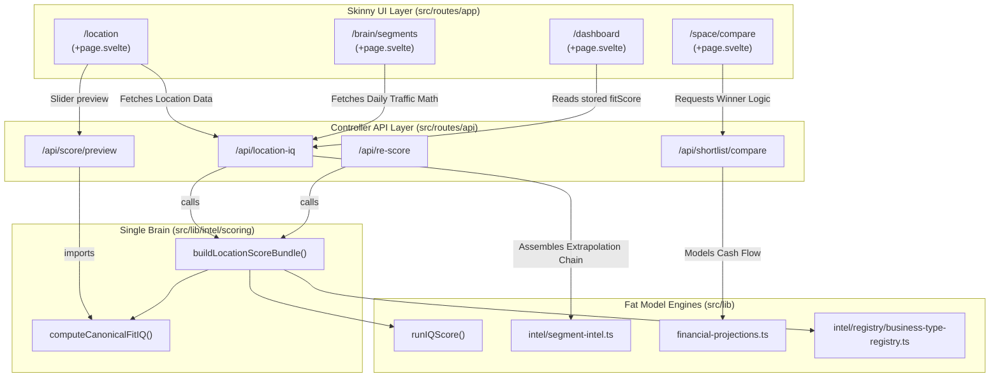

# RE² Route Traceability Matrix

> [!IMPORTANT]
> **The Golden Rule for UI Component Design:** 
> Do **NOT** use `Math.round()`, arithmetic operators, or derive new business intelligence scores inside `+page.svelte` files. If a metric needs to change based on a user interaction, the UI must hit the backend API and wait for the official response.

> [!CAUTION]
> **Fit IQ Formula — Single Source of Truth (04.22.2026):**
> The canonical Fit IQ formula is `Math.round(locationIQ * 0.60 + visionIQ * 0.40)` and lives ONLY in `$lib/intel/scoring/bundle-builder.ts` → `computeCanonicalFitIQ()`. Do NOT hardcode this formula anywhere else. Both `api/location-iq` and `api/re-score` call `buildLocationScoreBundle()` which uses this function internally.

Below is the definitive mapping of RE² core frontend paths to their backend sources of truth. 

## Codebase Data Flow (Mermaid Blueprint)

## Traceability Matrix

| Frontend Route | Primary Purpose | Backend API Call | Core Logic Engine (Source of Truth) | Prohibited Actions (Skinny UI Rule) |
| :--- | :--- | :--- | :--- | :--- |
| `/app/location` | Overall location viability & fit | `GET /api/location-iq` | • `buildLocationScoreBundle()` • `computeCanonicalFitIQ()` | Must not manually parse Overpass/Foursquare. Consume `officialCompetitorsInfo` from server. |
| `/app/brain/segments` `/app/brain/daypart`| Pedestrian demographics & foot traffic | `GET /api/location-iq` | • `intel/segment-intel.ts` | Do NOT use local Svelte `$derived` to calculate blend-rates. Read from `coffeeChain`. |
| `/app/brain/transparency` | Six-dimension score breakdown | `(Reads cached API data)` | • `runIQScore()` | No arithmetic operators; consume raw JSON values. |
| `/app/dashboard` | Portfolio management & shortlisting | `(Reads stored fitScore)` | • `readStoredFitScores()` • `decision-engine.ts` | **Do not recalculate `fitIQ`!** Trust the server-persisted `fitScore`. Never use `locationIQ * 0.75`. |
| `/app/space/compare` | Financial real-estate comparison | `POST /api/shortlist/compare` | • `financial-projections.ts` | Do not cross-compare using local frontend maps; read `winners` object directly. |

## Persistence Rules (04.22.2026)

| Key | What Gets Written | Source | Never Write From |
| :--- | :--- | :--- | :--- |
| `re2_session.fitScore` | Canonical Fit IQ | Server via `getCanonicalScores()` | Client-side `Math.round()` formulas |
| `re2_session.locationIQ` | Location IQ composite | Server via `compassComposite` | Client-side `runIQScore()` preview |
| `re2_session.sixScores` | Six dimension scores | Server via `compassScores` | — |
| `re2_competitors` | Competitor list (cache) | Server `officialCompetitorsInfo` | Client-side 4-source extraction `$effect` |
| `scoredLocations[].fitScore` | Dashboard Fit IQ | Server via `getCanonicalScores()` | `recanonicalizeScores()` (deprecated) |

---

> [!TIP]
> **Adopting the Fat Model, Skinny Controller Architecture**
> If you are building a new page or modifying a metric:
> 1. Find the corresponding file in `src/lib/intel/*`
> 2. Ensure the math is exported as a function or defined on an interface payload.
> 3. Verify `api/***/+server.ts` routes the new metric into your frontend JSON.
> 4. In `+page.svelte`, use it passively (e.g. `{businessCase.revenueY1}`).
